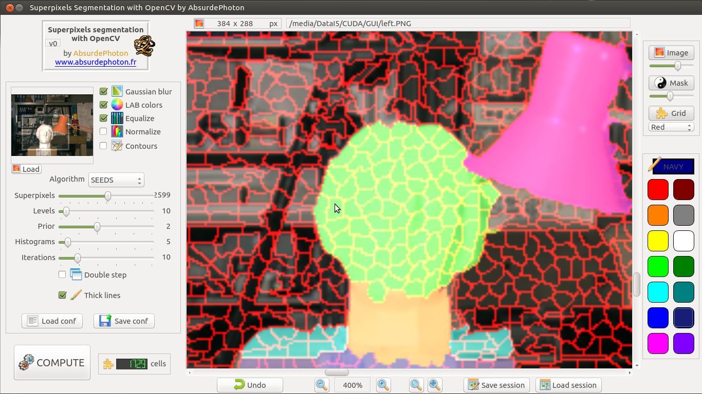
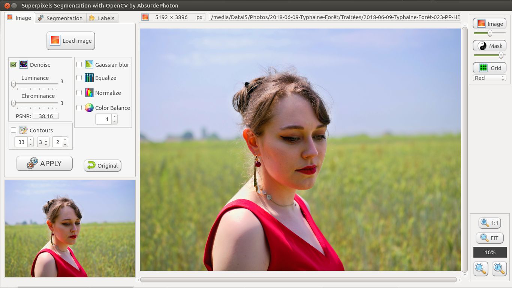

# superpixels-segmentation-gui-opencv
## Superpixels segmentation algorithms with QT and OpenCV, with a nice GUI to manage labels and colorize the cells
### v2 - 2018-09-02

 

## HISTORY

* v0: launch
* v1: added contours + several improvements
* v2: tabbed workflow + labels management + PSD and TIFF export + create cell
 
 

## LICENSE

The present code is under GPL v3 license, that means you can do almost whatever you want
with it!

I used bits of code from several sources, mainly from the openCV examples
 
 

## WHY?

I didn't find any simple tool (understand: GUI) to produce depth maps from my stereo pictures.

One solution to semi-automatically produce depth maps is image segmentation: coloring zones with superpixel cells is so easy! In photoshop, it is then child play to apply gray gradients to colored areas...

I'm not an ace of C++ and QT, in fact I only started using them some month ago. So, if you don't find my code pretty never mind, because it WORKS, and that's all I'm asking of it :)
 
 

## WITH WHAT?

Developed using:
* Linux Ubuntu	16.04
* QT Creator 3.5
* Requires these libraries:
  * QT 5
  * openCV 3.4 compiled with openCV-contribs - should work with 3.x versions without much corrections
  * Image Magick 7

This software should also work under Microsoft Windows: if you tried it successfully please contact me, I'd like to offer compiled Windows executables
 
 

## HOW?

* Help is available in the GUI, with each element's tooltip
* This tool is composed of 3 tabs

### IMAGE TAB

* To begin, load an image, nothing is possible without it! The image appears in the main viewport and its thumbnail is shown on the left side

* You can then apply filters and effects on the image:
  * tick the chosen actions
  * press APPLY
  * some filters can take a long time to compute, especially the noise filter (which is highly recommended by the way)
  * filters are always applied to the ORIGINAL image, you can't restart from a previously altered image
  * click ont the ORIGINAL button to revert to the loaded image file
  
* You can come back when you want to the Image tab and re-apply filters

* Be aware that when you load a new image, if you computed some segmentation and/or worked on labels and cells, all this work will be lost if you d'ont save the session! More about this later
  
### SEGMENTATION TAB

[Screenshot](screenshot-segmentation.jpg)

* First, select the algorithm you want to use, and tune the parameters

* Available superpixels algorithms:
  * SLIC (Simple Linear Iterative Clustering) clusters pixels using pixel channels and image plane space to efficiently generate compact, nearly uniform superpixels
  * SLICO (Zero parameter SLIC) optimizes SLIC, using adaptive compactness factor
  * MSLIC (Manifold SLIC) optimizes SLIC using manifold methods resulting in more content-sensitive superpixels
  * LSC (Linear Spectral Clustering) produces compact and uniform superpixels with low computational costs, and keeps global images properties
  * SEEDS (Superpixels Extracted via Energy-Driven Sampling) uses an efficient hill-climbing algorithm to optimize the superpixels' energy function that is based on color histograms and a boundary term, producing smooth boundaries
  
* Push the COMPUTE button, wait a little

* The result is displayed:
  * the number of defined cells is displayed next to the COMPUTE button
  * you now have on your right 3 layers that you can activate / deactivate / blend in the viewport :
    * the processed image
    * the (for the moment) empty colored mask
    * the superpixels (cells) grid (this is what you just computed)
  
* You can save and retrieve the segmentation parameters (XML openCV format) - the filters and effects parameters from the Image tab will also be saved

### LABELS TAB

[Screenshot](screenshot-labels.jpg)

This tab has two functions: colorize the cells and manage the labels

Basic operations:
  * on your left, you can find the default "rename me!" label:
  * double-click on it to change its name
  * now choose a color, that you can pick from the default palette buttons, or with the more sophisticated color-picker just over them
  * the selected label's color appears on the label indicator (the one with the pen, just above the color palette). The indicator also shows the selected label's name

* Manage the labels:
  * you can add a label: rename it and choose its color, then begin to fill in the cells for that label
  * you can delete a label: it will also delete the corresponding color in the mask
  * select several labels and click the JOIN button: the result is only one label with all the cells the same color. Rename the label and change its color as it pleases you
  * select one label and click on the eye button above it: its color is hidden in the mask. Select a color and it will be back
  
* It is time to colorize the cells:
  * left mouse button to colorize with the the current color - you can hold down the mouse button and move it to set several cells
  * right mouse button to unset a cell (you don't have to select the label it belongs to)
  * <CTRL> key + left mouse click to floodfill a closed area
  * <CTRL> key + right mouse click to floodfill to transparent a whole contiguous cells area previously colorized
  * UNDO: use this button to cancel the last action

* Change the view:
  * you can choose the transparency of the image and mask with the sliders on the right (image and mask)
  * you can change the grid color with the control just under the grid layer button
  * use the zoom controls on the right to zoom in / out - you can also use the mouse wheel over the viewport
  * click on the thumbnail to choose the zoomed area in the viewport
  * hold the middle mouse button on the viewport to move the view position when the image is zoomed in - you can also use the scrollbars
  
* Modifiy the cells:
  * the superpixel algorithms often misses important details: you can define your own cells with the special "Create new cell" button
  * the editor enters a special state: you have to draw your cell in white color
  * you can set pixels with the left mouse button, and unset them with the right
  * use the <CTRL> key to floodfill entire zones, just like explained before
  * once a pixel is set, it can become the origin of a line:
    * hold down the <SPACE> key and mouve the mouse over the viewport: a temporary line appears
    * release <SPACE> and the line is set
    * the end of a line becomes the new origin from which you can draw another one
    * click with the left mouse button to set a pixel to change once again the origin of the lines
  * when you are done with drawing:
    * click on the "create new cell" button: you can choose to define the new cell or cancel
    * if effectively drawn:
      * it is not possible to get back to the previous state, the UNDO button will not work
      * the new cell boundaries appear in the grid mask
      * it is filled with purple color, in the mask layer (I like purple!)
      * the new label contains this cell: you can now join it to another (or leave this label as is)
      * now you can set and unset this new cell

* Load and save:
  * you can save the current session with a base name (several files are saved)
  * no need to recompute when you retrieve a session: just load the image first, then the session XML file
  * what is saved in the session:
    * processed image (PNG image)
    * mask (PNG image)
    * grid (PNG image)
    * cells / labels (XML openCV format) 
  * you can export the processed image and the labels to PSD or TIFF image formats:
    * in a PSD Photoshop image, the processed image is the background, and the labels are transparent separated layers
    * in a TIFF image, each image and label has its own page. Be careful, many software onmy open the first page
    * the PSD and TIFF images work well with an open-source program: The Gimp
    * the PSD files cannot be loaded with Photoshop 7. They work with PHotoshop CS6, but I don't know if it is the case with Photoshop CS to CS5 (let me know if you tried)
   
 
 

## Enjoy!

### AbsurdePhoton
My photographer website ''Photongénique'': www.absurdephoton.fr
